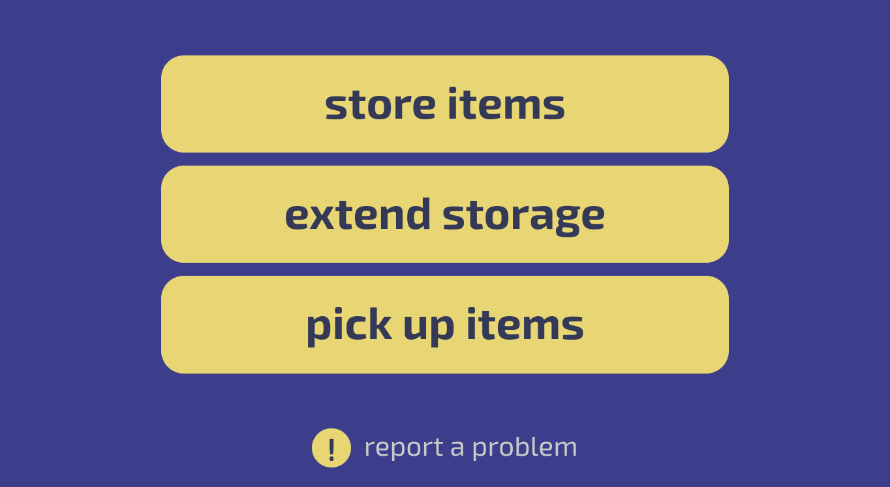
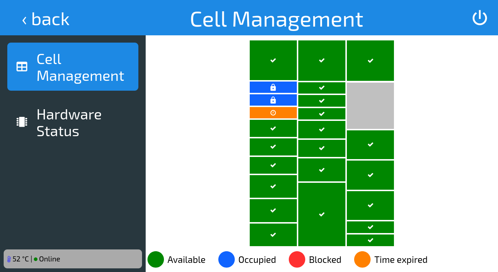

# Postamat Frontend

Kiosk-mode web interface for smart storage locker systems. Built with Vue 3 and designed to run fullscreen in a browser on a touchscreen terminal.

Users can rent a locker cell, store items, scan a receipt to retrieve them, extend storage time, and pay fines — all through an intuitive touch interface with a custom on-screen keyboard.



## Deployment & Architecture

This is a **kiosk-mode** application. Both the frontend and backend run on the **same physical machine** — the smart storage locker terminal. The browser is launched in fullscreen kiosk mode on a touchscreen display with no access to DevTools or address bar.

**Why HTTP instead of HTTPS?**

The API is only ever accessed over `localhost` on the same device. There is no network exposure, no man-in-the-middle risk, and no need for TLS certificates. Adding HTTPS would introduce unnecessary complexity and certificate management burden on embedded hardware with no security benefit.

**Why no auth tokens?**

The admin panel is protected by a hidden entry gesture and simple credential check — this is sufficient for the threat model. The terminal runs in a locked-down kiosk environment with no browser address bar, no DevTools, and no way for an end user to intercept or replay API calls. Token-based auth would add complexity without meaningful protection in this context.

**Why landscape only?**

The UI is purpose-built for the horizontal touchscreen embedded in the locker hardware. All layouts, font sizes, and spacing are optimized for a landscape orientation. A portrait mode is also partially supported for development and testing purposes.

**Backend source code**

The backend is **not included** in this repository and is not publicly available. It is proprietary software distributed under a **Non-Disclosure Agreement (NDA)**. This frontend repository is published as a standalone reference implementation.

## Tech Stack

- **Vue 3** (Options API)
- **Vue Router 4** — SPA navigation with lazy-loaded routes
- **Pinia** — state management
- **SCSS** — scoped component styles + shared design tokens
- **TypeScript** — helpers, API client, store modules, and tests
- **Vite 6** — fast dev server and optimized builds with PostCSS plugins
- **ESLint** + `@typescript-eslint` — linting with TypeScript parser for `.vue` files
- **Prettier** — code formatting
- **Husky** + **lint-staged** — pre-commit hooks for linting and formatting

## Features

- **Interactive locker map** — recursive rendering of the locker layout with color-coded cell states (available, occupied, blocked, timeout)
- **On-screen keyboard** — custom virtual keyboard with shift/caps/number layers for touchscreen input
- **Camera feed** — real-time canvas-based camera stream for receipt scanning
- **Payment flow** — terminal payment integration with polling for transaction status
- **Penalty system** — automatic fine calculation and payment for overdue storage
- **Admin panel** — hardware monitoring, cell management (block/unblock), and operation logs
- **Dev mode** — all API calls are stubbed in development, allowing full UI testing without hardware

## Project Structure

```
src/
  __tests__/              # Vitest test files (api, format, order, timer)
  api/                    # API client with mock data for dev mode
    index.ts              # Fetch wrapper with mock/dev mode support
    types.ts              # API response types
    locker.json           # Static locker layout data
  components/             # Reusable Vue components (30 components)
    VirtualKeyboard.vue   # Custom on-screen keyboard with shift/caps/layers
    LockerGrid.vue        # Recursive locker grid renderer
    PageBody.vue          # Page layout wrapper
    PageHeader.vue        # Page header with back navigation
    PageWithKB.vue        # Page with integrated on-screen keyboard
    PaymentTerminal.vue   # Payment terminal widget
    AdminHardware.vue     # Hardware monitoring display
    AdminManage.vue       # Cell management interface
    ActivityLog.vue       # Operation log viewer
    ...
  helpers/                # Utilities
    constants.ts          # Route names, support contact info
    format.ts             # Formatting: pad, timestamp, phone, email
    timer.ts              # Timer wrappers that auto-stop on navigation
  routes/                 # Vue Router configuration
    index.ts              # Router instance
    routes.ts             # Route definitions (lazy-loaded)
  store/modules/          # Pinia store modules
    order.ts              # Order state (phone, mail, size, cell, time, etc.)
  templates/
    App.vue               # Root component
    views/                # Page-level components
      passForStorage/     # New storage rental flow (15 views)
      complete/           # Item pickup flow (14 views)
      extend/             # Storage extension flow (6 views)
      AdminPanel.vue      # Admin panel
      HomeView.vue        # Landing page
      SecretMenu.vue      # Admin login
      ErrorView.vue       # Error display
      ...
  static/
    scss/                 # Global styles (variables, mixins, grid, reset)
    fonts/                # Exo2 + NerdFont source files
    images/               # Icons and placeholders
  env.d.ts                # Vite client type declarations
  main.ts                 # App entry point
public/                   # Static assets served at root (fonts, images, favicon)
```

## Getting Started

```bash
npm install
cp .env.example .env     # Create local env file
npm run dev               # Dev server at localhost:8081
npm run build             # Production build to dist/
npm run lint              # Run ESLint
npm run test              # Run tests (vitest)
```

## Environment Variables

All variables are defined in `.env` (gitignored) and must be prefixed with `VITE_` to be exposed to the client bundle by Vite. Shell environment variables override `.env` values.

| Variable | Description | Default |
|----------|-------------|---------|
| `VITE_API_URL` | Backend server base URL | `http://localhost:8555/` |
| `VITE_USE_MOCK` | When `"true"`, all API calls return mock data regardless of mode | `""` |
| `VITE_ADMIN_LOGIN` | Admin panel login credential | `admin` |
| `VITE_ADMIN_PASSWORD` | Admin panel password credential | `admin` |

The variables are accessed via `import.meta.env.VITE_*` in source code. Mock data is active by default in dev mode; set `VITE_USE_MOCK=true` to enable mocks in production builds.

## Testing

```bash
npm run test              # Single run (47 tests)
npm run test:watch        # Watch mode
```

Tests are located in `src/__tests__/` and use Vitest with jsdom for DOM simulation:

- `api.test.ts` — API client and fetch wrapper
- `format.test.ts` — Formatting utilities
- `order.test.ts` — Order store logic
- `timer.test.ts` — Timer wrappers

## Linting

```bash
npm run lint              # Run ESLint on src/
```

ESLint is configured with `vue-eslint-parser` + `@typescript-eslint/parser` to support TypeScript in `.vue` files. Pre-commit hooks run linting and formatting automatically via Husky + lint-staged.

## Admin Panel

The admin panel is hidden behind a secret gesture:

1. On the home screen, tap the **top-left corner** 4 times in quick succession
2. A login screen will appear
3. Enter credentials (defaults: `admin` / `admin`) and tap Next

The admin panel provides:
- Hardware monitoring (temperature, online status)
- Cell management (block/unblock individual cells)
- Operation logs with date filtering



## API

The frontend communicates with a backend server at the URL configured via `API_URL` (default: `http://localhost:8555`). All requests use `GET` method, have a 15-second timeout, and return JSON responses.

> **Note:** The frontend and backend run on the same physical machine (the kiosk terminal). The API is accessed over localhost, is not exposed to the network, and runs in a kiosk-mode browser with no access to DevTools. For this reason, the API intentionally uses HTTP (not HTTPS) and the admin panel authenticates on the client side — these are deliberate design choices, not security oversights.

### Locker Layout

#### `GET /get-locker`

Returns the locker cell layout as a nested JSON tree. The tree structure defines the visual grid of cells.

```json
{
  "childs": [
    {
      "width": 80,
      "childs": [
        { "height": 70, "type": "L", "id": 1, "available": false, "status": "free", "blocked": false },
        { "height": 20, "type": "M", "id": 2, "available": true,  "status": "occupied", "blocked": true }
      ]
    }
  ]
}
```

| Field | Type | Description |
|-------|------|-------------|
| `childs` | `array` | Child nodes (groups or cells) |
| `width` | `number` | Relative flex width of the group (absent on leaf cells) |
| `height` | `number` | Relative flex height of the cell |
| `type` | `string` | Cell size category: `"M"`, `"L"`, `"XL"`, or `"none"` (structural slot) |
| `id` | `number` | Unique cell identifier |
| `available` | `boolean` | Whether the cell can accept a new storage session |
| `status` | `string` | Current state: `"free"`, `"occupied"`, `"timeout"`, `"blocked"`, `"none"` |
| `blocked` | `boolean` | Whether the cell is administratively blocked |

#### `GET /get-sizes`

Returns available cell size categories with pricing.

```json
{ "sizes": [
  { "id": "M", "size": "15x20", "price": 50, "available": true },
  { "id": "L", "size": "15x20", "price": 100, "available": true },
  { "id": "XL", "size": "15x20", "price": 150, "available": true }
]}
```

| Field | Type | Description |
|-------|------|-------------|
| `sizes` | `array` | List of available size categories |
| `sizes[].id` | `string` | Size identifier (`"M"`, `"L"`, `"XL"`) |
| `sizes[].size` | `string` | Physical dimensions (e.g. `"15x20"` cm) |
| `sizes[].price` | `number` | Hourly rate in currency units |
| `sizes[].available` | `boolean` | Whether this size category has available cells |

#### `GET /busy`

Checks if all cells are occupied.

| Field | Type | Description |
|-------|------|-------------|
| `busy` | `boolean` | `true` if no cells are available for storage |

### Storage Session

#### `GET /open-cell`

Opens a specific cell door for the user to place or retrieve items.

| Param | Type | Description |
|-------|------|-------------|
| `cell` | `number` | Cell ID |
| `phone` | `string` | User's phone number (optional) |
| `mail` | `string` | User's email address (optional) |

Returns `true` on success.

#### `GET /storage-begin`

Registers a new storage session after payment.

| Param | Type | Description |
|-------|------|-------------|
| `cell` | `number` | Cell ID |
| `phone` | `string` | User's phone number |
| `mail` | `string` | User's email address |
| `hours` | `number` | Paid storage duration in hours |

Returns `true` on success.

#### `GET /extend`

Extends an existing storage session.

| Param | Type | Description |
|-------|------|-------------|
| `cell` | `number` | Cell ID |
| `hours` | `number` | Additional hours to add |

Returns `true` on success.

#### `GET /close`

Cancels the current payment request (called when leaving the payment page).

Returns `true` on success.

#### `GET /complete`

Finishes a storage session (called when user picks up items).

| Param | Type | Description |
|-------|------|-------------|
| `cell` | `number` | Cell ID |

Returns no body (void).

### Cell State

#### `GET /is-open`

Checks whether a cell door is currently open.

| Param | Type | Description |
|-------|------|-------------|
| `cell` | `number` | Cell ID |

| Field | Type | Description |
|-------|------|-------------|
| _(root)_ | `boolean` | `true` if the cell door is open |

#### `GET /get-timeout`

Returns the cell open timeout — how long the door stays open before auto-closing.

| Field | Type | Description |
|-------|------|-------------|
| _(root)_ | `number` | Timeout in seconds |

#### `GET /get-time`

Returns the remaining storage time for a cell.

| Param | Type | Description |
|-------|------|-------------|
| `cell` | `number` | Cell ID |

| Field | Type | Description |
|-------|------|-------------|
| _(root)_ | `number` | Remaining time in seconds |

#### `GET /get-price`

Returns the hourly rate for a specific cell.

| Param | Type | Description |
|-------|------|-------------|
| `cell` | `number` | Cell ID |

| Field | Type | Description |
|-------|------|-------------|
| _(root)_ | `number` | Hourly rate in currency units |

### Code & Scan

#### `GET /check-code`

Verifies a receipt code entered by the user.

| Param | Type | Description |
|-------|------|-------------|
| `code` | `string` | 4-digit receipt code |

| Field | Type | Description |
|-------|------|-------------|
| `status` | `string` | `"ok"` — valid code, proceed; `"timeout"` — storage time expired, fine required; `"block"` — cell is blocked; `"not found"` — unknown code; `"error"` — server error |
| `cell` | `number` | Cell ID associated with the code |

#### `GET /start-scan`

Starts the receipt scanner hardware. Returns no body.

#### `GET /stop-scan`

Stops the receipt scanner hardware. Returns no body.

#### `GET /scan`

Polls for a scanned receipt code.

| Field | Type | Description |
|-------|------|-------------|
| _(root)_ | `string \| null` | Scanned code as a string, or `null` if nothing scanned yet |

#### `GET /cam/<token>`

Returns the current camera frame as an image (JPEG/PNG). Used for rendering in a canvas element.

### Payment

#### `GET /invoice`

Issues a payment invoice for the given amount.

| Param | Type | Description |
|-------|------|-------------|
| `sum` | `number` | Total amount to charge |

Returns `true` on success.

#### `GET /is-paid`

Polls the payment terminal for transaction status.

| Field | Type | Description |
|-------|------|-------------|
| _(root)_ | `string` | `"wait"` — payment pending; `"success"` — payment completed; `"error"` — payment failed |

### Penalty

#### `GET /get-penalty-info`

Returns overdue fine details for a cell.

| Param | Type | Description |
|-------|------|-------------|
| `cell` | `number` | Cell ID |

| Field | Type | Description |
|-------|------|-------------|
| `timeout` | `string` | How long the storage was overdue (e.g. `"6h"`) |
| `penalty` | `number` | Fine amount in currency units |

#### `GET /fine-paid`

Confirms that the fine has been paid.

| Param | Type | Description |
|-------|------|-------------|
| `cell` | `number` | Cell ID |

Returns `true` on success.

### Admin

#### `GET /get-hardware-info`

Returns terminal hardware status.

| Field | Type | Description |
|-------|------|-------------|
| `temp` | `number` | CPU/system temperature in Celsius |
| `online` | `boolean` | Whether the terminal is online |

#### `GET /get-log`

Returns paginated operation logs filtered by date range.

| Param | Type | Description |
|-------|------|-------------|
| `start-year` | `number` | Filter start year |
| `start-month` | `number` | Filter start month (1–12) |
| `start-day` | `number` | Filter start day (1–31) |
| `end-year` | `number` | Filter end year |
| `end-month` | `number` | Filter end month (1–12) |
| `end-day` | `number` | Filter end day (1–31) |
| `offset` | `number` | Page offset (0-based, 30 items per page) |

Response is an array of log entries:

| Field | Type | Description |
|-------|------|-------------|
| `datetime` | `number` | Unix timestamp in seconds |
| `cell` | `number` | Cell ID |
| `action` | `string` | Action type: `"open"`, `"close"`, etc. |
| `mail` | `string` | User's email |
| `phone` | `string` | User's phone number |
| `id` | `number` | Unique log entry ID |

#### `GET /get-times`

Returns the storage start and end timestamps for a cell.

| Param | Type | Description |
|-------|------|-------------|
| `id` | `number` | Cell ID |

| Field | Type | Description |
|-------|------|-------------|
| `start` | `number` | Storage start time (Unix timestamp in milliseconds) |
| `end` | `number` | Storage end time (Unix timestamp in milliseconds) |

#### `GET /get-cell-info`

Returns contact info for the cell occupant.

| Param | Type | Description |
|-------|------|-------------|
| `code` | `string` | Receipt code |

| Field | Type | Description |
|-------|------|-------------|
| `phone` | `string` | Occupant's phone number |
| `mail` | `string` | Occupant's email address |

#### `GET /block`

Blocks a cell administratively (prevents new storage sessions).

| Param | Type | Description |
|-------|------|-------------|
| `id` | `number` | Cell ID |

Returns no body.

#### `GET /unblock`

Unblocks a previously blocked cell.

| Param | Type | Description |
|-------|------|-------------|
| `id` | `number` | Cell ID |

Returns no body.

### System

#### `GET /shutdown`

Shuts down the terminal. Returns no body.

#### `GET /reboot`

Reboots the terminal. Returns no body.

### Error Handling

All endpoints return HTTP errors (non-2xx status) on failure. The frontend catches these and redirects to the internal error page. Requests that exceed 15 seconds are aborted automatically via `AbortController`.

## Architecture Notes

- **Self-cleaning timers** — `timer.interval()` and `timer.timeout()` automatically stop when the user navigates away, preventing memory leaks in the SPA.
- **Recursive locker rendering** — `LockerGrid.vue` renders arbitrarily nested cell groups by recursively composing itself, supporting complex locker layouts with mixed cell sizes.
- **Dynamic keyboard** — `VirtualKeyboard.vue` generates rows and buttons from props using a computed property, with per-button style overrides via `buttonsParams`.
- **Static assets** — `public/` contains files served directly at root (fonts, images). `src/static/` holds source assets bundled by Vite.
